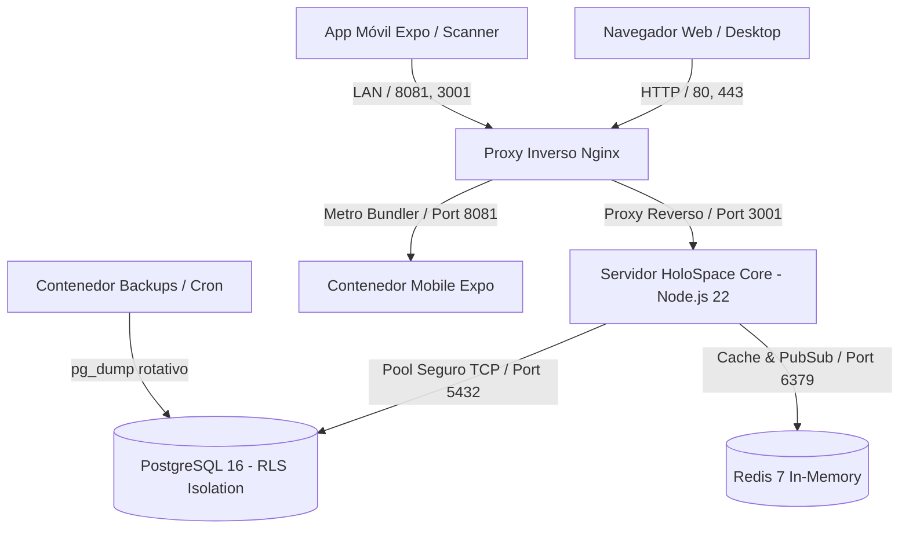
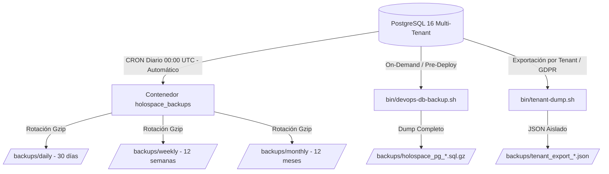

# Arquitectura Canónica e Infraestructura — HoloSpace Baseline

## Integración MCP (Model Context Protocol)

HyCanvas expone un servidor MCP nativo en `/mcp`:
* **Endpoint:** `https://hycanvas.holospace.com.ar/mcp`
* **Transporte:** Streamable HTTP con JSON-RPC 2.0.
* **Autenticación:** `Bearer hyk_...` (Scoped: `generate`, `read`, `export`).
* **Herramientas Disponibles:** `generate_presentation`, `get_job`, `list_templates`, `list_themes`, `get_design_file`, `export_design`, `create_share_link`.

> Documento maestro de arquitectura del sistema, topología de infraestructura en Docker, aislamiento relacional multi-tenant con PostgreSQL 16 (RLS), motor de autenticación criptográfica, estrategia de respaldos y sistema de logging dinámico.

---

## 1. Visión General de la Arquitectura

HoloSpace Baseline es una plataforma SaaS B2B Multi-Tenant diseñada con arquitectura desacoplada, alta disponibilidad, separación estricta de responsabilidades y soberanía total de datos por organización cliente.



---

## 2. Estructura de Directorios del Código Fuente

```text
holospace-baseline/
├── .agents/                        ← Reglas y skills de agentes de inteligencia artificial
├── bin/                            ← Scripts de operaciones DevOps (refresco, backups, dump)
├── data/                           ← Esquema SQL canónico DDL y semillas oficiales
│   └── init-schema.sql
├── docs/                           ← 6 Documentos Canónicos de la Plataforma
│   ├── README.md                   ← Guía de inicio rápido, credenciales y comandos Docker
│   ├── ARCHITECTURE.md             ← Arquitectura técnica, BD PostgreSQL RLS y Motor de Temas
│   ├── MODULES.md                  ← Especificación de los 4 módulos oficiales y creación
│   ├── FEATURES.md                 ← Matriz de roles RBAC, planes comerciales y facturación
│   ├── CONTENT.md                  ← Copys oficiales de marketing, sprites y landing page
│   └── ROADMAP.md                  ← Evolución SaaS y matriz de trabajo
├── lib/                            ← Capas transversales del backend
│   ├── auth.js                     ← Hashing scrypt, JWT engine, middleware RBAC
│   ├── billing.js                  ← Catálogo de planes, auto-onboarding y webhooks
│   ├── db.js                       ← Adaptador relacional PostgreSQL con RLS
│   ├── entitlement.js              ← Motor de licenciamiento y feature flags
│   └── logger.js                   ← Motor de logging dinámico y estructurado
├── logs/                           ← Almacenamiento dinámico de logs (Global y Tenants)
│   ├── global/
│   └── tenants/
├── modules/                        ← 4 Módulos Oficiales Desacoplados
│   ├── core/                       ← Plataforma base, auth y motor de temas
│   ├── tenant/                     ← Gobierno SaaS (SuperAdmin)
│   ├── kanban/                     ← Tablero Kanban logístico web y parseo PDF
│   └── scanner/                    ← App Móvil Expo / React Native
├── nginx/                          ← Configuración del proxy inverso Nginx
├── public/                         ← Assets compilados del frontend web (SPA)
├── tests/                          ← Suite integral de pruebas automatizadas
├── Dockerfile                      ← Imagen de contenedor Node.js 22
├── docker-compose.yml              ← Orquestación multicontenedor de servicios
├── package.json                    ← Dependencias y scripts de ejecución
└── server.js                       ← Servidor HTTP y enrutador modular principal
```

---

## 3. Infraestructura y Orquestación Docker

```yaml
services:
  app:
    container_name: holospace_app
    ports: ["3001:3001"]
    depends_on:
      postgres: { condition: service_healthy }
  postgres:
    container_name: holospace_postgres
    image: postgres:16-alpine
    ports: ["5434:5432"]
    volumes: [postgres_data:/var/lib/postgresql/data]
  redis:
    container_name: holospace_redis
    image: redis:7-alpine
    ports: ["6382:6379"]
  proxy:
    container_name: holospace_proxy
    image: nginx:alpine
    ports: ["80:80", "443:443"]
  mobile:
    container_name: holospace_mobile
    ports: ["8081:8081", "19000-19001:19000-19001"]
  backups:
    container_name: holospace_backups
    image: prodrigestivill/postgres-backup-local:16-alpine
```

---

## 4. Aislamiento Multi-Tenant con PostgreSQL 16 (Row Level Security)

```sql
ALTER TABLE core_users ENABLE ROW LEVEL SECURITY;
ALTER TABLE kanban_orders ENABLE ROW LEVEL SECURITY;
ALTER TABLE kanban_order_items ENABLE ROW LEVEL SECURITY;
ALTER TABLE core_audit_logs ENABLE ROW LEVEL SECURITY;
ALTER TABLE tenant_modules ENABLE ROW LEVEL SECURITY;
ALTER TABLE core_app_settings ENABLE ROW LEVEL SECURITY;
ALTER TABLE core_platform_audit_logs ENABLE ROW LEVEL SECURITY;
ALTER TABLE fourseee_competitor_monitors ENABLE ROW LEVEL SECURITY;
ALTER TABLE fourseee_catalog_items ENABLE ROW LEVEL SECURITY;
ALTER TABLE fourseee_margin_rules ENABLE ROW LEVEL SECURITY;
ALTER TABLE fourseee_connected_stores ENABLE ROW LEVEL SECURITY;
ALTER TABLE fourseee_products ENABLE ROW LEVEL SECURITY;
ALTER TABLE fourseee_competitors ENABLE ROW LEVEL SECURITY;
ALTER TABLE fourseee_product_competitor_mappings ENABLE ROW LEVEL SECURITY;
ALTER TABLE fourseee_price_logs ENABLE ROW LEVEL SECURITY;
ALTER TABLE fourseee_pricing_rules ENABLE ROW LEVEL SECURITY;
ALTER TABLE fourseee_price_update_queue ENABLE ROW LEVEL SECURITY;
ALTER TABLE core_roles ENABLE ROW LEVEL SECURITY;

CREATE POLICY rls_orders_tenant_isolation ON kanban_orders
  FOR ALL
  USING (
    current_setting('app.is_superadmin', true) = 'true' 
    OR tenant_id = NULLIF(current_setting('app.current_tenant_id', true), '')::uuid
  )
  WITH CHECK (
    current_setting('app.is_superadmin', true) = 'true' 
    OR tenant_id = NULLIF(current_setting('app.current_tenant_id', true), '')::uuid
  );

-- Políticas RLS idénticas aplicadas sobre fourseee_products, fourseee_competitors, fourseee_product_competitor_mappings, fourseee_price_logs, fourseee_pricing_rules, fourseee_price_update_queue, fourseee_connected_stores, fourseee_competitor_monitors, fourseee_catalog_items, fourseee_margin_rules, core_users, core_roles, core_audit_logs, core_app_settings y core_platform_audit_logs.
```

---

## 5. Seguridad Criptográfica, Motor JWT y Gestión Segura de Credenciales Multi-Tienda

- **Hashing de Contraseñas:** Algoritmo `scrypt` (`N=16384, r=8, p=1`) con salt criptográfico de 16 bytes.
- **JSON Web Tokens (JWT):** Firmados con HMAC-SHA256 con claims estructurados (`sub`, `tenantId`, `tenantSlug`, `role`, `entitlements`).
- **Almacenamiento y Enmascaramiento de Credenciales Multi-Tienda (4see):**
  - Las credenciales de conexión (`consumer_key`, `consumer_secret`, `access_token`) se almacenan aisladas por organización en la tabla `fourseee_connected_stores` protegida por PostgreSQL 16 RLS.
  - Al listar tiendas (`GET /api/4see/stores`), todo secreto es sanitizado y enmascarado (`maskStoreCredentials`), impidiendo la filtración de claves al frontend.
  - Las operaciones de auditoría (`POST /api/4see/store/audit-live`) y de write-back aceptan `store_id`, resolviendo las credenciales de forma segura dentro del backend sin transmitirlas por red.
  - Las actualizaciones no destructivas conservan los secretos previos si el usuario deja los campos en blanco o envía la máscara `••••••••`.

---

## 6. Estrategia de Respaldos y Recuperación ante Desastres (Disaster Recovery)

HoloSpace implementa un modelo de respaldos redundante de dos niveles para garantizar la continuidad del negocio y la integridad de datos de todas las empresas clientes:



### A. Nivel 1: Respaldos Automatizados en Docker (Daemon CRON)
- **Servicio:** Contenedor `holospace_backups` (`prodrigestivill/postgres-backup-local:16-alpine`).
- **Frecuencia (CRON):** `SCHEDULE=@daily` (se ejecuta automáticamente a las 00:00 UTC).
- **Compresión:** Algoritmo Gzip de nivel máximo (`-Z 9`).
- **Política de Retención y Rotación Automática:**
  - **Diarios:** Conserva los últimos 30 días (`BACKUP_KEEP_DAYS=30`).
  - **Semanales:** Conserva las últimas 12 semanas (`BACKUP_KEEP_WEEKS=12`).
  - **Mensuales:** Conserva los últimos 12 meses (`BACKUP_KEEP_MONTHS=12`).

### B. Nivel 2: Respaldos On-Demand y Exportación por Tenant
1. **Respaldo Global Inmediato (Pre-Deploy / Mantenimiento):**
   ```bash
   ./bin/devops-db-backup.sh
   ```
   Genera instantáneamente un archivo comprimido verificado: `/backups/holospace_pg_YYYYMMDD_HHMMSS.sql.gz`.

2. **Exportación Aislada de una Sola Empresa (Data Portability / GDPR):**
   ```bash
   ./bin/tenant-dump.sh drinklovers
   ```
   Extrae únicamente los pedidos, usuarios, configuraciones y módulos del tenant especificado en formato JSON.

### C. Procedimiento de Restauración ante Desastres (Disaster Recovery):
Para restaurar una copia de seguridad en caso de fallo catastrófico:
```bash
# 1. Descomprimir el respaldo deseado
gunzip -c backups/holospace_pg_YYYYMMDD_HHMMSS.sql.gz | docker exec -i holospace_postgres psql -U holospace_admin -d holospace_saas
```

## 7. Estrategia de Logging y Telemetría (lib/logger.js)

- **Global:** `logs/global/app-YYYY-MM-DD.log` y `logs/global/error-YYYY-MM-DD.log`.
- **Tenants:** `logs/tenants/<slug>/activity.log`, `audit.log` y `errors.log` creados dinámicamente.

---

## 7. Sistema de Temas y Diseño Centralizado (HoloSpace HW-DS Engine)

> **Ubicación Canónica de Definiciones:** `/modules/themes/`  
> **Archivo Único de la Verdad (Single Source of Truth):** `/modules/themes/themes.json`  
> **API de Suministro:** `GET /api/theme` / `POST /api/theme`  
> **Consumidores:** Servidor Backend (`server.js`), Web App (`public/app.js`), Mobile App (`modules/scanner/src/store/useThemeStore.ts`).

### 7.1 Metodología de Temas: Single Source of Truth
1. **Cero Hardcoding en Módulos:** Queda terminantemente prohibido definir archivos de temas o colores duplicados dentro de las carpetas individuales de cada módulo (`modules/core`, `modules/kanban`, `modules/scanner`, etc.).
2. **Definición Declarativa Central:** Todos los temas y sus tokens residen en un único archivo JSON: `modules/themes/themes.json`.
3. **Módulo Exportador Node.js:** `modules/themes/index.js` exporta el diccionario `THEMES` y las funciones de consulta (`getTheme`, `listThemes`) para el backend.
4. **Distribución en Tiempo Real (API REST):**
   - El endpoint `GET /api/theme` entrega en tiempo real los tokens del tema según la jerarquía:
     - **Preferencia de Usuario:** Guardada en la columna `users.theme_preference`.
     - **Preferencia de Tenant:** Guardada en la tabla `app_settings (active_theme)`.
     - **Fallback de Plataforma:** `omarchy_tiling`.
5. **Cero Hardcodes de Color en UI (Regla de Oro):** Queda terminantemente prohibido incorporar estilos inline con colores fijos (`style="background-color: #..."`) o clases fijas saturadas en barras de navegación, menús de módulos, submenús de features o tarjetas. Todos los componentes deben consumir obligatoriamente los tokens dinámicos del sistema (`var(--bg-main)`, `var(--card-bg)`, `var(--card-border)`, `var(--cobalt)`, `var(--emerald)`).

### 7.2 Catálogo Oficial de los 7 Temas de Plataforma (Dark y Light)

| Clave (`key`) | Nombre Oficial | Modo | Tipografía | Radio Borde | Fondo Principal | Acento Principal |
| :--- | :--- | :---: | :--- | :--- | :--- | :--- |
| **`omarchy_tiling`** | **Omarchy Tiling** *(Predeterminado)* | Dark | `JetBrains Mono` / `Press Start 2P` | `4px` (Tiling estricto) | `#121317` | Verde Menta (`#A6DA95`) |
| **`omarchy_tiling_light`** | **Omarchy Light** | Light | `JetBrains Mono` | `4px` (Tiling estricto) | `#F6F8FA` | Esmeralda (`#059669`) / Cobalto (`#6366F1`) |
| **`omarchy_aetheria`** | **Omarchy Aetherial** | Dark | `JetBrains Mono` / `Press Start 2P` | `4px` (Tiling estricto) | `#0E091D` (OLED) | Teal (`#14B9B5`) / Violeta (`#7C3AED`) |
| **`soft_minimal_pastel`** | **Soft Pastel** | Dark | `Plus Jakarta Sans` | `16px` / `20px` (Píldoras) | `#1E1E2E` (Catppuccin Mocha) | Menta (`#A6E3A1`) / Lavanda (`#89B4FA`) |
| **`soft_minimal_pastel_light`** | **Soft Pastel Light** | Light | `Plus Jakarta Sans` | `16px` / `20px` (Píldoras) | `#EFF1F5` (Catppuccin Latte) | Verde (`#40A02B`) / Azul (`#1E66F5`) |
| **`dark_glassmorphism`** | **Dark Glass** | Dark | `Outfit` | `24px` (Glass) | `#0B0E14` (Cristal oscuro) | Esmeralda (`#00E676`) / Cobalto (`#3B82F6`) |
| **`cyberpunk_glassmorphism`**| **Cyberpunk Glass** | Dark | `Press Start 2P` | `8px` (Synthwave) | `#05050A` (Neon) | Cian (`#00FFCC`) / Magenta (`#FF007F`) |

### 7.3 Mapa de Tokens Estándar por Tema (`modules/themes/themes.json`)
```json
{
  "key": "omarchy_tiling",
  "name": "Omarchy Tiling",
  "background": "#121317",
  "cardBg": "#1A1B22",
  "cardBorder": "#2E303E",
  "emerald": "#A6DA95",
  "cobalt": "#BD93F9",
  "amber": "#F1FA8C",
  "red": "#FF5555",
  "textMain": "#F8F8F2",
  "textMuted": "#6272A4",
  "fontFamily": "JetBrains Mono",
  "fontMono": "JetBrains Mono",
  "borderRadius": 4,
  "radiusCard": 4,
  "radiusBtn": 4,
  "radiusBadge": 2,
  "borderWidth": 1,
  "backdropBlur": "none",
  "boxShadow": "none"
}
```

### 7.4 Regla de Aislamiento de Fondos Dinámicos
* Fondo Dinámico Espacial (Estrellas a 60s, grilla y asteroides): Confinado exclusivamente a Landing Page (/landing) y Pantalla de Login (/login).
* Módulos Internos Autenticados (/tenant, /core, /kanban, /scanner): Fondo estático sólido limpio sin animaciones para garantizar máximo rendimiento, legibilidad y ahorro de batería.

### 7.5 Capa Ontológica E-Commerce On-The-Fly y Conectores Multitienda (Módulo 4see)
* **Contrato Ontológico Universal (`StoreListing`):** Normaliza esquemas dispares de plataformas externas (Tiendanube, WooCommerce, Shopify) en un objeto estándar en memoria `{ external_id, title, sku, barcode_gtin, brand, unit_price, stock, categories, seo_title, seo_description }`.
* **Cero Persistencia Obligatoria:** Los catálogos externos se consultan y auditan en caliente ("on the fly") vía API sin poblar tablas locales en PostgreSQL 16.
* **Motor de Reglas OQL Determinístico (`rules_engine.js`):** Validador matemático de expresiones (regex de EAN-13, longitud de títulos, marca y completitud SEO) sin dependencia de modelos de inteligencia artificial en fase inicial.
* **Asistente Interactivo de Atributos & Inferencia On-The-Fly:** Inferencia heurística de marca a partir del título (`inferBrandFromTitle`), generación de códigos EAN-13 internos estándar GS1 prefijo 200 con checksum módulo 10 (`generateSuggestedEan`) y control total del usuario para editar libremente o aplicar sugerencias con re-auditoría reactiva en memoria.
* **Write-back Selectivo:** Permite enviar mutaciones puntuales aprobadas directamente a la tienda del cliente vía `PUT /products/{id}`.

---

## 8. Protocolo de Sincronización y Consistencia de Pedidos (ScanBan Web <-> Scanner Mobile)

Para garantizar consistencia atómica e impedir falsos positivos de desasignación entre el Tablero Kanban y el Escáner Móvil:
1. **Columnas de Asignación Duales en PostgreSQL:** Toda mutación hacia estado `DOING` actualiza de manera idempotente tanto `operator_email` como `assigned_operator_email`.
2. **Consultas Unificadas de Pedidos en Proceso:** Los endpoints `/api/scanban/my-doing-orders` y `/api/scanban/active-order` filtran con `(LOWER(operator_email) = ? OR LOWER(assigned_operator_email) = ?)` asegurando que cualquier orden asignada por administrador o tomada por operario sea descubierta de inmediato.
3. **Validación Estricta de Toma de Pedidos en Cliente:** El servicio `fileWorkflowService.claimOrder` y el store `useOrderStore` validan la confirmación del servidor HTTP 200 con payload de orden persistida antes de transicionar la interfaz local, evitando pedidos en memoria no respaldados por la base de datos.
4. **Aislamiento Multi-Tenant Exhaustivo en Helpers de Base de Datos:** La función central `getFullOrderFromDb` y todos los endpoints de mutación y lectura (`mark-ready`, `mark-backlog`, `assign-order`, `release-order-admin`, `delete-order`, `claim-order`, `complete-order`, `pdf-raw`) incluyen obligatoriamente la cláusula `AND tenant_id = ?`, erradicando colisiones de números de pedido idénticos entre organizaciones diferentes.
5. **Persistencia Transaccional de Avance de Escaneo (`/api/scanban/update-scan-progress`):** Cada lectura de código (cámara o manual) actualiza inmediatamente `orders.total_items_scanned` y `order_items.quantity_scanned` en PostgreSQL, previniendo reversiones a cero durante la sincronización periódica, complementado con retroalimentación acústica PCM WAV de 1200Hz y compatibilidad con Silent Mode en iOS.
6. **Transición Atómica Directa `DOING -> DONE` y Optimización Visual:** Al presionar `CERRAR Y DESPACHAR PEDIDO` en `OrderSummaryScreen`, la mutación en PostgreSQL se ejecuta inmediatamente, ocultando el botón de escaneo ante verificación completa (100%) y presentando una pantalla de confirmación centrada puramente informativa.
7. **Estabilización de Ciclo de Vida de Órdenes Despachadas:** La sincronización periódica en segundo plano (`loadInitialOrders`) protege y preserva órdenes en estado `CLOSED`, `DONE` y `PARTIAL_DISPATCH` de ser sobreescritas a `null`, garantizando que `DispatchScreen` permanezca visible y centrada hasta que el operario toque `VOLVER A LISTA DE PEDIDOS`.

---

## 9. Subsistema de Control de Acceso Basado en Roles (RBAC) y Permisos Granulares

HoloSpace implementa un modelo de autorización desacoplado de nivel empresarial (NIST RBAC Nivel 2):

### 9.1 Modelo de Datos Relacional (`init-schema.sql`)
1. **`core_permissions` (Catálogo Inmutable de Capacidades):**
   - Clave primaria natural: `key VARCHAR(100)` con formato estandarizado `<modulo>:<recurso>:<accion>` (ej: `kanban:orders:read`, `4see:pricing:write`, `core:roles:manage`).
   - Atributos: `module_code`, `name`, `description`, `category`.
2. **`core_roles` (Roles del Sistema y Personalizados):**
   - Identificador técnico: `id UUID PRIMARY KEY`.
   - Distinción de alcance: `is_system BOOLEAN` (`true` para roles nativos modulares: `superadmin`, `tenant_admin`, `core_admin`, `kanban_admin`, `kanban_operator`, `scanner_operator`, `4see_admin`, `4see_user`; `false` para roles creados por clientes).
   - Multi-Tenancy: `tenant_id UUID REFERENCES tenant_tenants(id)` (aislado con RLS para impedir fuga entre organizaciones).
3. **`core_role_permissions` (Mapeo N:M):**
   - Vinculación `(role_id, permission_key)`.
4. **`core_users.role_id` (Asignación Dinámica):**
   - Columna `role_id UUID REFERENCES core_roles(id)` que reemplaza la antigua dependencia de strings fijos.
   - Enfoque directo sin vistas legadas: todo el stack interactúa exclusivamente con los nombres canónicos de tablas modulares (`core_*`, `kanban_*`, `tenant_*`, `fourseee_*`).

### 9.2 Contrato Canónico de Error 403 (`INSUFFICIENT_PERMISSIONS`)
Cuando cualquier usuario intenta ejecutar una acción sin contar con el permiso correspondiente, el backend emite una respuesta unificada con código HTTP 403:
```json
{
  "error": "Acceso denegado: Permisos insuficientes",
  "code": "INSUFFICIENT_PERMISSIONS",
  "required_permission": "4see:pricing:write",
  "module": "4see",
  "message": "Se requiere el permiso '4see:pricing:write' para realizar esta acción.",
  "timestamp": "2026-09-11T18:00:00.000Z"
}
```

### 9.3 Interceptor Centralizado y Modal UI/UX
En el frontend (`public/app.js`), el cliente intercepta respuestas 403 con `code === 'INSUFFICIENT_PERMISSIONS'`, renderizando el modal de advertencia (`permissionDeniedModal`) con el chip destacado del permiso faltante y el módulo afectado sin interrumpir la sesión del usuario.

---

## 10. Estándar Canónico de UI/UX y Patrón ABM/CRUD Unificado (HoloSpace Standard CRUD Template)

Toda pantalla de Altas, Bajas y Modificaciones (CRUD/ABM) en la plataforma HoloSpace Baseline debe apegarse estrictamente a la plantilla canónica sintetizada a partir de `Core / Usuarios`, asegurando consistencia visual, búsqueda reactiva universal y eliminación de texto truncado.

### 10.1 Principios Visuales y de Interacción
1. **Jerarquía Visual Sobria:** La cabecera del panel (`.actions-bar`) se compone de un título descriptivo (`<h2>`, 24px/900), un subtítulo explicativo (`var(--text-muted)`) y una barra de herramientas (`.actions-controls`) que agrupa el buscador reactivo (`.input-search`) y el botón de acción primaria (`.btn-primary`, fondo esmeralda con texto en alto contraste).
2. **Cero Emojis:** Queda prohibido el uso de emojis en títulos, botones, estados o tablas. Toda señalización se construye mediante tipografía sobria (Outfit, JetBrains Mono) y tokens CSS (`var(--emerald)`, `var(--card-bg)`, `var(--text-main)`).
3. **Puntos Indicadores de Estado:** La columna de estado implementa indicadores con punto sólido en lugar de chips pesados: `● Activo` en `var(--emerald)` o `○ Desactivado` / `○ Suspendido` en `var(--red)`.

### 10.2 Política Estricta Anti-Truncado de Textos
Para garantizar que los textos nunca se corten ni se compriman antiestéticamente en resoluciones intermedias:
1. **Contenedor Responsivo Obligatorio (`.table-responsive-container`):** Toda tabla tabular debe residir dentro de un contenedor con scroll horizontal (`overflow-x: auto`), radio de curvatura y borde acorde al tema activo (`public/css/holospace-theme.css`).
2. **Preservación de Texto en Celdas (`.data-table td`):**
   - Se aplica `white-space: normal`, `overflow-wrap: anywhere` y `word-break: break-word` para nombres largos, descripciones, correos y URLs, garantizando que el texto fluya sin truncamiento ni desbordes.
3. **Elementos Atómicos Protegidos (`white-space: nowrap`):**
   - Se reserva `nowrap` exclusivamente para elementos que jamás deben romperse en múltiples líneas: badges de rol (`.badge-role`), etiquetas de organización (`.badge-tenant`), indicadores de estado (`.status-indicator`) y grupos de botones de acción (`.data-table-actions`).
4. **Reserva Tipográfica por Columna:** Cada encabezado (`<th>`) define un ancho mínimo (`min-width`) adaptado a su naturaleza de dato (ej: 140px para slugs, 200px para nombres, 160px para acciones).

### 10.3 Motor de Búsqueda Reactiva en Tiempo Real
1. **Filtrado en Cliente (In-Memory Filtering):** Al recibir los datos de la API, el controlador los almacena en una variable en memoria (`cached[Entidad]List`).
2. **Respuesta Instantánea (`oninput`):** El campo `.input-search` ejecuta la función `filter[Entidad]Table(query)` que evalúa coincidencias insensibles a mayúsculas/minúsculas en múltiples columnas (identificador, nombre, correo, categoría, estado).
3. **Empty State Homogéneo:** Si la búsqueda no produce resultados, la tabla renderiza una fila descriptiva con mensaje sobrio: *"No se encontraron registros que coincidan con la búsqueda."*

### 10.4 Ciclo de Vida de Controladores y Modales Homogéneos
1. **Modales de Modo Dual (Crear / Editar):** Se reutiliza un único modal por entidad (`open[Entidad]Modal(id = null)`), adaptando el título y los campos mutables según el contexto.
2. **Borrado Lógico Idempotente:** Toda baja o cambio de disponibilidad se efectúa mediante mutación de estado lógico (`active: false` o `status: 'suspended'`), preservando la integridad referencial en PostgreSQL 16.
3. **Captura Centralizada de Errores RBAC:** Si un usuario sin permisos suficientes intenta mutar una entidad, el cliente captura el código `INSUFFICIENT_PERMISSIONS` (HTTP 403) y presenta el modal de denegación sin bloquear la interfaz.

---

## 11. Arquitectura de Autenticación Federada OAuth2 / OpenID Connect y Cuotas Granulares

Para brindar una experiencia de acceso World-Class orientada a empresas B2B, la plataforma incorpora una capa modular de federación de identidad desacoplada, preservando el motor centralizado de autorización RBAC y Row-Level Security (RLS).

### 11.1 Principios de Identidad Federada Desacoplada
1. **Desacople entre Autenticación y Autorización:** Los proveedores OAuth2 (Google Workspace, Microsoft Entra ID / Azure AD, GitHub) se encargan única y exclusivamente de autenticar y validar la identidad del usuario (`sub`, `email`, `name`, `picture`). La autorización, pertenencia a organizaciones (`tenant_id`), roles (`core_roles`) y permisos granulares siguen bajo el gobierno exclusivo de PostgreSQL 16 y los tokens JWT firmados de HoloSpace.
2. **Arquitectura Multi-Proveedor Universal (`lib/oauth.js`):** El backend expone rutas dinámicas parametrizadas por proveedor:
   - `GET /api/auth/:provider`: Redirección hacia el concentrador de consentimiento con parámetros de seguridad (`client_id`, `redirect_uri`, `scope: 'openid email profile'`, `state` criptográfico anti-CSRF).
   - `GET /api/auth/:provider/callback`: Recepción del código de autorización, canje por tokens, validación de firma criptográfica OpenID Connect y resolución atómica del usuario.

### 11.2 Modelo de Datos Relacional para Federación y Cuotas por Rol
```sql
-- Extensión de la tabla core_users para soporte multi-proveedor
ALTER TABLE core_users ADD COLUMN IF NOT EXISTS auth_provider VARCHAR(32) NOT NULL DEFAULT 'local';
ALTER TABLE core_users ADD COLUMN IF NOT EXISTS auth_provider_id VARCHAR(255);
ALTER TABLE core_users ADD COLUMN IF NOT EXISTS avatar_url TEXT;

-- Índice para búsquedas federadas eficientes
CREATE INDEX IF NOT EXISTS idx_core_users_auth_provider ON core_users(auth_provider, auth_provider_id);

-- Extensión de tenant_plans para soporte de cuotas granulares por rol
ALTER TABLE tenant_plans ADD COLUMN IF NOT EXISTS role_quotas JSONB NOT NULL DEFAULT '{}'::jsonb;
```

### 11.3 Flujo Híbrido de Onboarding con Google OAuth2
1. **Usuario Existente con Organización:** Al autenticarse exitosamente mediante Google, el sistema localiza su cuenta por `email` o `auth_provider_id`. Si pertenece a un Tenant activo, emite de inmediato el JWT con sus permisos granulares RBAC y lo redirige a su módulo autorizado (`/kanban`, `/4see` o `/core`).
2. **Usuario Nuevo sin Organización (Self-Service Onboarding):** Si el email verificado por Google no existe en la plataforma, el sistema extrae su nombre y avatar oficial, desplegando el selector interactivo de **Línea de Producto** (Kanban o 4see) y **Nivel de Plan** (Simple, Business, Enterprise). Al confirmar el nombre de su empresa:
   - Se crea el nuevo `tenant_tenants` con su propio UUID.
   - Se crea el usuario en `core_users` vinculándolo a Google (`auth_provider = 'google'`) con rol inicial de Administrador (`kanban_admin` o `4see_admin`).
   - Se genera la suscripción inicial en `tenant_subscriptions` asignando las cuotas de roles correspondientes.
   - Se habilitan los módulos contratados en `tenant_modules`.
   - Se emite el token JWT y se redirige al dashboard del módulo sin requerir ingreso manual de contraseñas.

### 11.4 Validación Estricta de Cuotas de Roles en Backend
En cada operación de alta o cambio de rol de usuario (`POST /api/users` o `PUT /api/users/:id`), el backend ejecuta la validación contra las cuotas configuradas en `tenant_plans.role_quotas`:
- Si se asigna un rol administrativo (`kanban_admin`, `core_admin`, `4see_admin`, `tenant_admin`), el sistema verifica:
  $$\text{Admins Activos} < \text{role\_quotas.max\_admins}$$
- Si se asigna un rol operativo (`kanban_operator`, `scanner_operator`, `4see_user`), el sistema verifica:
  $$\text{Operarios Activos} < \text{role\_quotas.max\_operators}$$
- Ante cualquier exceso, el endpoint responde HTTP 422 / 403 con contrato estructurado:
  ```json
  {
    "error": "Límite de cuota excedido",
    "code": "ROLE_QUOTA_EXCEEDED",
    "role": "kanban_admin",
    "limit": 3,
    "current": 3,
    "message": "Su plan actual solo permite hasta 3 administradores. Actualice su suscripción para habilitar más cupos."
  }
  ```

### 11.5 Multi-Suscripción Concurrente y Consolidación Acumulada de Cuotas (Zero Bundles)
Para permitir máxima flexibilidad comercial sin acoplar módulos innecesarios a los clientes, la plataforma erradica los paquetes genéricos (bundles) y adopta una arquitectura de líneas comerciales 100% verticales (`kanban_*` y `fourseee_*`):

1. **Restricción Relacional Compuesta:** En la tabla `tenant_subscriptions`, la restricción única se define como `UNIQUE(tenant_id, plan_code)`, posibilitando que una misma organización posea simultáneamente contratos independientes para logística y para inteligencia comercial.
2. **Consolidación en Capa de Entitlements (`lib/entitlement.js`):** La función `getTenantSubscriptionAndUsage(tenantId)` recupera todas las suscripciones activas del tenant y consolida acumulativamente sus límites:
   - Capacidad total de usuarios: $\sum \text{plan.max\_users}$.
   - Capacidad mensual de pedidos: $\sum \text{plan.max\_orders\_monthly}$.
   - Cuotas desglosadas por rol: $\sum \text{role\_quotas.max\_admins}$, $\sum \text{role\_quotas.max\_operators}$, $\sum \text{role\_quotas.max\_analysts}$.
3. **Gobierno en API (`server.js`):** Los endpoints `/api/tenants` exponen de manera estructurada los planes contratados por vertical (`kanban_plan` y `fourseee_plan`) junto con el desglose completo de suscripciones en `subscriptions`, permitiendo a los administradores activar, cambiar o cancelar suscripciones por vertical de forma desacoplada.


