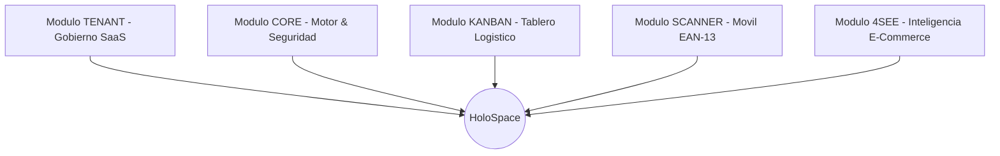

# HoloSpace Baseline — Estrategia de Contenidos & Landing Page World-Class

> Documento maestro de marketing, propuesta de valor, arquitectura de persuasión, pilares de ingeniería, especificación de los 5 módulos con estética sprite pixel art y catálogo de precios en Pesos Argentinos (ARS).

---

## 1. Propuesta de Valor Central (Hero Section)

### Titular de Alto Impacto (H1):
**"El Sistema Operativo SaaS Multi-Tenant para Logística Inteligente y Control Total de Depósitos."**

### Subtítulo (Subheadline):
*Digitaliza el flujo de preparación de pedidos, elimina errores de despacho con escaneo EAN-13 móvil en tiempo real y gestiona múltiples empresas con aislamiento estricto de datos en una infraestructura soberana de alto rendimiento.*

### Llamados a la Acción Principales (CTAs):
- **Botón Primario:** `[ Iniciar Prueba Gratuita ]` -> Desplazamiento suave a la tabla de planes comerciales (`#planes`).
- **Botón Secundario:** `[ Ver Demo en Vivo ]` -> Acceso guiado interactivo a la aplicación web (`/login`).

### Badge de Autoridad / Confianza:
`PostgreSQL 16 RLS Criptografico • Docker Multi-Tenant • 100% Offline-Ready`

---

## 2. Los 5 Módulos de la Plataforma (Sprites Pixel Art)

### Módulo 1: TENANT (Gobierno SaaS & Multitenancy)
- **Estética Sprite:** Castillo / Edificio central con corona dorada (`#EED49F`).
- **Propósito:** Panel exclusivo para SuperAdmin.
- **Capacidades:** Directorio de organizaciones cliente, alta y edición de empresas, suspensión inmediata, asignación de cuotas de usuarios y órdenes, y toggle de licencias modulares en caliente.

### Módulo 2: CORE (Plataforma Base & Seguridad Criptográfica)
- **Estética Sprite:** Núcleo de energía / Chip CPU con pulso neón (`#8AADF4`).
- **Propósito:** Capa fundamental del sistema.
- **Capacidades:** Aislamiento relacional PostgreSQL 16 con Row Level Security (RLS), autenticación segura con hashing `scrypt` y JWT, auditoría de eventos de plataforma y motor de temas visuales jerárquicos (Omarchy Tiling, Aetheria, Glassmorphism).

### Módulo 3: KANBAN (Logística Web & Ingesta PDF)
- **Estética Sprite:** Tablero de misiones / Pergamino logístico (`#A6DA95`).
- **Propósito:** Gestión operativa de pedidos para depósitos y centros de distribución.
- **Capacidades:** Tablero interactivo de 4 columnas (Backlog, Listo, En Proceso, Completado), parser inteligente de facturas PDF (extracción sin inventar datos de clientes, SKUs, códigos de barra y cantidades) y asignación balanceada a operarios.

### Módulo 4: SCANNER (App Móvil EAN-13 con Modo Offline)
- **Estética Sprite:** Gameboy / Lector láser retro (`#F5A97F` / `#ED8796`).
- **Propósito:** Aplicación nativa y web para operarios de picking y depósito.
- **Capacidades:** Lectura ultrarrápida de códigos de barra EAN-13 utilizando la cámara del celular, base de datos local SQLite (`holospace.db`) para operar en zonas de depósito sin Wi-Fi, feedback sensorial (sonidos de éxito/error y vibración háptica) y conexión instantánea vía QR.

### Módulo 5: 4SEE (Inteligencia E-Commerce & Repricing en Piloto Automático)
- **Estética Sprite:** Radar orbital / Ojo cibernético retro (`#C6A0F6` / `#F5A97F`).
- **Propósito:** Vigilancia automática de competidores, auditoría de catálogo y dynamic pricing con piso inquebrantable.
- **Capacidades:** Mapeo 1 a N de productos propios contra múltiples competidores simultáneos, blindaje matemático de margen piso inquebrantable (`min_price_floor = costo * (1 + margen) + costos_op`), captura de sobremargen por quiebre de stock ajeno (*out-of-stock*), histórico inmutable de precios, motor SmartPrice determinista IF/THEN, worker asíncrono no bloqueante en background y cola de repricing con aprobación en 1 clic o push automático hacia Tiendanube y WooCommerce.

---

## 3. Catálogo Oficial de Planes Comerciales por Solución Vertical

> La Landing Page presenta una vitrina con selector de solución interactivo que permite contratar la suite Logística (Kanban + Scanner) o la suite E-Commerce (4see Intelligence), o contratar bundles corporativos.

### Línea Logística (Kanban + Scanner)

| Característica | Kanban Simple | Kanban Business (Recomendado) | Kanban Enterprise |
| :--- | :---: | :---: | :---: |
| **Precio Mensual (USD)** | **$ 39 USD / mes** | **$ 119 USD / mes** | **$ 299 USD / mes** |
| **Usuarios Administradores** | Hasta **1 Admin** | Hasta **3 Admins** | **Ilimitados** |
| **Operarios de Depósito** | Hasta **3 Operarios** | Hasta **15 Operarios** | **Ilimitados** |
| **Volumen de Pedidos** | Hasta **500 órdenes / mes** | Hasta **3.000 órdenes / mes** | **Ilimitados** |
| **Módulo Core & Auth** | Incluido | Incluido | Incluido |
| **Tablero Kanban Logístico** | Incluido | Incluido | Incluido |
| **Escáner Móvil EAN-13** | Incluido | Incluido | Incluido |
| **Ingesta de Facturas PDF** | Básico | Automático con parser | Automático en lote |
| **Soporte Técnico** | Estándar | Prioritario | Dedicado 24/7 + SLA |

### Línea E-Commerce (4see Intelligence)

| Característica | 4see Simple | 4see Business (Recomendado) | 4see Enterprise |
| :--- | :---: | :---: | :---: |
| **Precio Mensual (USD)** | **$ 49 USD / mes** | **$ 149 USD / mes** | **$ 349 USD / mes** |
| **Usuarios Administradores** | Hasta **1 Admin** | Hasta **2 Admins** | **Ilimitados** |
| **Analistas de Catálogo** | Hasta **2 Analistas** | Hasta **8 Analistas** | **Ilimitados** |
| **Monitoreo de Publicaciones** | Sí | Multi-competidor continuo | Corporativo ilimitado |
| **Diff View & Aprobación 1-Clic** | Incluido | Incluido | Incluido |
| **Sugerencias de Repricing (+8%)**| Incluido | Incluido | Incluido |
| **Integraciones ERP y Multi-Cuenta**| No disponible | 2 Cuentas Mercado Libre | Multi-cuenta + API |

### Combinación Modular Multi-Suscripción

Para empresas con operaciones integrales (depósito físico y venta online), HoloSpace permite contratar de forma simultánea e independiente planes de ambas líneas verticales:
- **Vertical Logística:** Kanban Simple ($39 USD), Kanban Business ($119 USD) o Kanban Enterprise ($299 USD).
- **Vertical E-Commerce:** 4see Simple ($49 USD), 4see Business ($149 USD) o 4see Enterprise ($349 USD).

Las cuotas de usuarios y límites mensuales se consolidan acumulativamente en la organización, manteniendo el aislamiento estricto de datos y el acceso modular por rol.

---

## 4. Seguridad, Soberanía y Respaldo Técnico

- **Aislamiento Criptográfico RLS:** Cumplimiento con normativas internacionales de privacidad (GDPR, SOC2).
- **Backups Automáticos Diarios:** Daemon CRON en Docker con compresión Gzip máxima y retención de 30 días, 12 semanas y 12 meses.
- **Data Portability (GDPR):** Exportación de datos aislada por tenant en formato JSON con un solo comando (`bin/tenant-dump.sh`).
- **Infraestructura Contenerizada:** 100% dockerizada (Node.js 22, PostgreSQL 16, Redis 7, Nginx) lista para servidores propios (Hetzner, AWS, Bare Metal).

